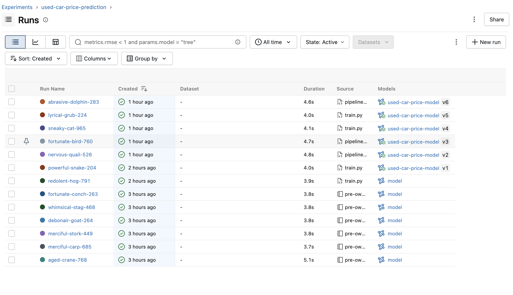
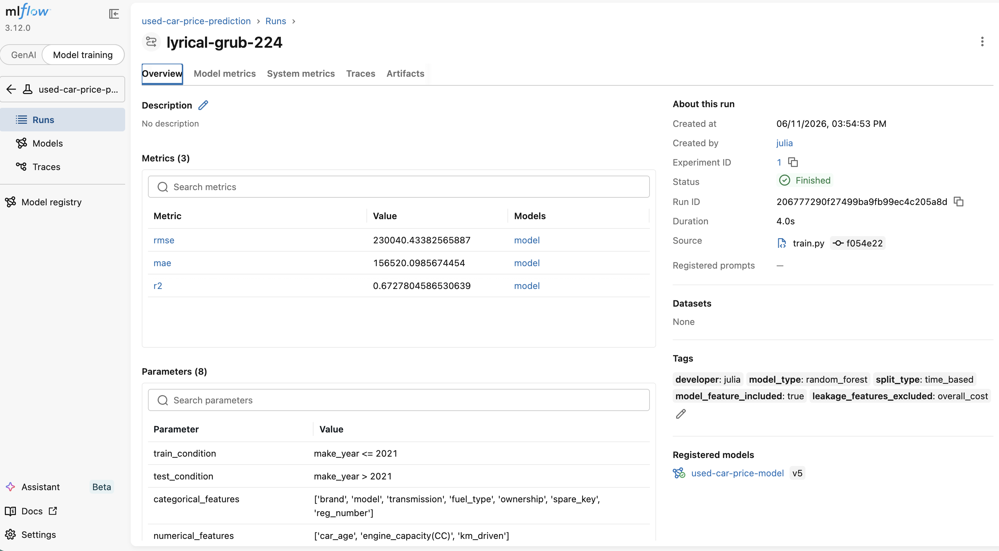
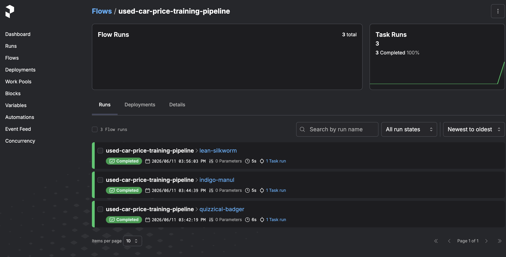
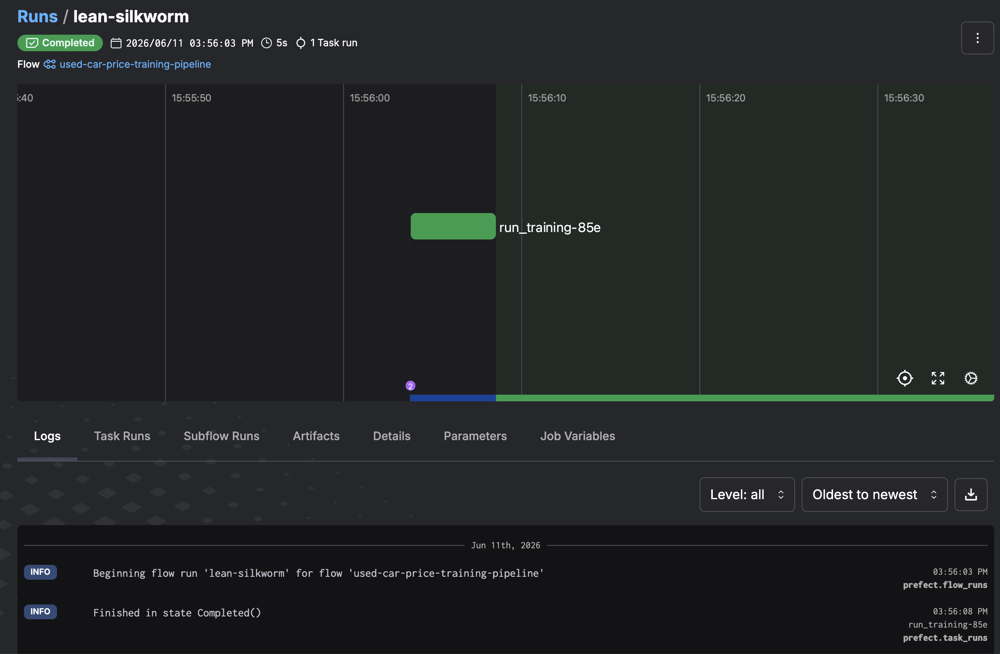
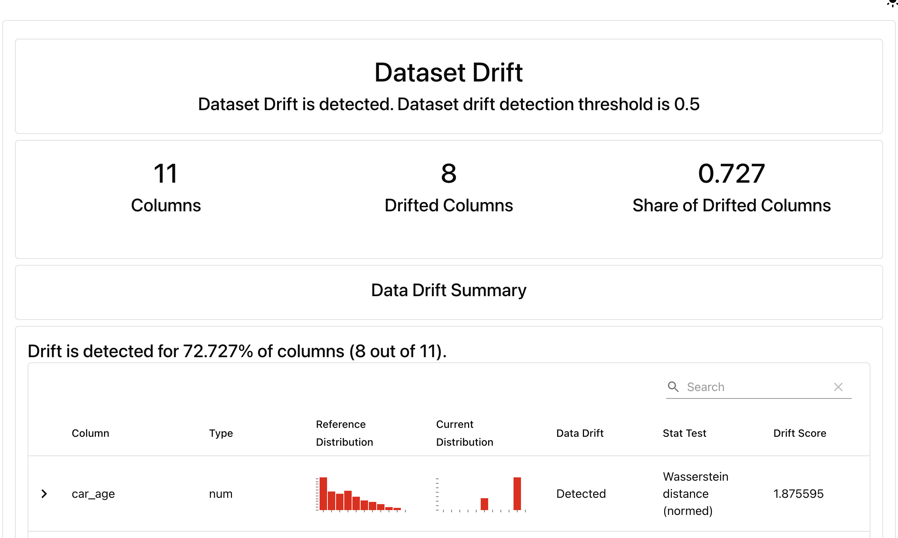

# Used Car Price Prediction MLOps Pipeline

An end-to-end MLOps project for predicting used car prices in the Indian automotive market.

The project covers the complete machine learning lifecycle, including data preparation, experiment tracking, workflow orchestration, model deployment, monitoring, testing, and CI/CD.

---

# Problem Description

The objective of this project is to predict the market price of a used car based on vehicle characteristics such as:

- brand
- model
- transmission type
- fuel type
- engine capacity
- ownership history
- mileage

This project was developed as the final project for the MLOps Zoomcamp program.

---

# Dataset

Dataset: **Cars India – Pre-Owned Vehicles**

Target variable:

```text
price
```

Features:

- brand
- model
- transmission
- fuel_type
- ownership
- spare_key
- reg_number
- car_age
- engine_capacity(CC)
- km_driven

Excluded features:

- overall_cost (potential target leakage)
- reg_year
- has_insurance
- title

---

# Project Architecture

```text
Raw Data
    │
    ▼
Data Cleaning
    │
    ▼
Feature Engineering
    │
    ▼
Model Training
(Random Forest)
    │
    ▼
MLflow Tracking
    │
    ▼
Model Registry
    │
    ▼
Docker Deployment
    │
    ▼
Monitoring (Evidently)
```

---

# Project Structure

```text
used-car-price-prediction-mlops/
│
├── data/
├── notebooks/
│
├── src/
│   ├── train.py
│   ├── predict.py
│   ├── monitor.py
│   ├── pipeline.py
│   ├── data.py
│   ├── features.py
│   └── config.py
│
├── models/
├── reports/
├── tests/
│
├── Dockerfile
├── Makefile
├── requirements.txt
├── .pre-commit-config.yaml
└── README.md
```

---

# Technologies

- Python
- Pandas
- Scikit-learn
- MLflow
- Prefect
- Docker
- Evidently
- Pytest
- Ruff
- Pre-commit
- GitHub Actions

---

# Experiment Tracking

MLflow is used to track:

- parameters
- metrics
- artifacts
- trained models

The project also uses the MLflow Model Registry to manage model versions.

## MLflow Experiments



## MLflow Run Details



---

# Workflow Orchestration

Prefect is used to orchestrate the training pipeline.

Pipeline steps:

1. Load data
2. Clean data
3. Train model
4. Log experiment
5. Register model

## Prefect Flow



## Prefect Run



---

# Model Registry

The best model is automatically registered in MLflow Model Registry and versioned.

Benefits:

- model versioning
- reproducibility
- model lifecycle management
- deployment-ready artifacts

---

# Model Deployment

The prediction service is containerized using Docker.

Build image:

```bash
docker build -t used-car-price-prediction .
```

Run container:

```bash
docker run --rm used-car-price-prediction
```

Example output:

```text
Predicted price: 1116391
```

---

# Monitoring

Evidently is used for dataset drift monitoring.

Reference dataset:

```text
Vehicles manufactured up to 2021
```

Current dataset:

```text
Vehicles manufactured after 2021
```

The monitoring report detected dataset drift in multiple features, including:

- car_age
- km_driven
- brand
- model
- prediction distribution

This indicates that newer vehicles differ significantly from the training data and may require model retraining.

## Evidently Report



---

# Alert Logic

The monitoring pipeline includes a simple alert mechanism.

Example:

```python
if drift_detected:
    print("ALERT: Dataset drift detected!")
```

This logic can later be extended to:

- email notifications
- Slack alerts
- automatic retraining triggers
- workflow automation through Prefect

---

# Model Performance

Production model:

```text
RandomForestRegressor
```

Evaluation strategy:

```text
Time-based split
```

Training data:

```text
make_year <= 2021
```

Test data:

```text
make_year > 2021
```

Metrics:

```text
RMSE ≈ 230,000
MAE  ≈ 156,000
R²   ≈ 0.67
```

## Leakage Investigation

Including the `overall_cost` feature increased model performance dramatically:

```text
R² ≈ 0.98
```

Further analysis revealed a very strong correlation between `overall_cost` and the target variable, suggesting potential target leakage.

Therefore, this feature was excluded from the production model.

---

# Testing

## Unit Tests

Covered components:

- data cleaning
- feature configuration

## Integration Tests

Covered components:

- prediction pipeline
- Docker execution

Run all tests:

```bash
pytest tests/
```

---

# Best Practices

Implemented:

- Unit tests
- Integration tests
- Makefile
- Ruff
- Pre-commit hooks
- GitHub Actions CI
- MLflow Model Registry
- Prefect orchestration
- Monitoring with Evidently

---

# CI/CD

GitHub Actions automatically runs:

```text
ruff
↓
unit tests
↓
integration tests
```

for every push and pull request.

---

# How to Run

Install dependencies:

```bash
pip install -r requirements.txt
```

Train model:

```bash
make train
```

Run tests:

```bash
make test
```

Generate monitoring report:

```bash
make monitor
```

Run training pipeline:

```bash
make pipeline
```

Run prediction:

```bash
make predict
```

Build Docker image:

```bash
make docker-build
```

Run Docker container:

```bash
make docker-run
```

---

# Future Improvements

Possible next steps:

- Hyperparameter optimization with Optuna
- Automated retraining workflows
- Model serving API with FastAPI
- Cloud deployment on AWS
- Monitoring dashboard with Grafana
- Scheduled batch predictions
- Data versioning with DVC

---
MLOps Zoomcamp Final Project